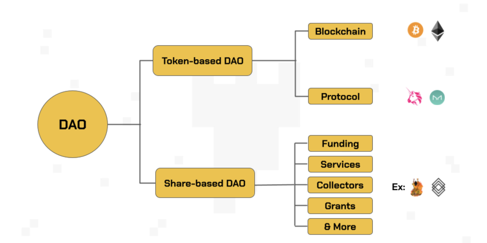

## DAO (Decentralized Autonomous Organization)

DAO là tổ chức tự trị phi tập trung. Khác với các tổ chức truyền thống (như Facebook, Google,...), bằng cách ứng dụng các bộ quy tắc được mã hóa bằng code, chúng có thể hoạt động một cách độc lập mà không cần sự can thiệp của con người.

DAO hoạt động theo 2 loại hình chính, bao gồm: Token-based DAO và Share-based DAO.

**Token-based DAO**: 

**Share-based DAO**:

**DAO để làm gì**:

**Ưu điểm mà DAO**: 
- Người tham gia có thẩm quyền như nhau
- Các phiếu bầu được kiểm dịnh và kết quả được hực hiện tự động khôn cần 1 bên trung gian.
- Tất cả hoạt động mang tính minh bạch công khai.

**Nhược điểm mà DAO**: 
- Tính pháp lý của DAO gần như bằng 0
- Thính phi tập trung không bị quản lý bởi một cơ quan, chính phủ kiến DAO có khả năng bị tấn công cao. 
- Thường bị trì hoãn gây thiệt hại lớn đối với những người tham gia.

**Tất công flash loan attack**
